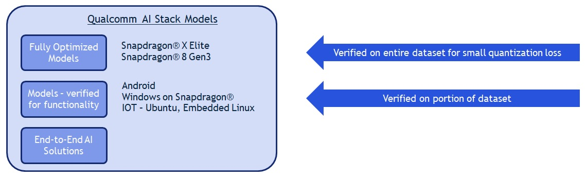

# Qualcomm AI Stack Models

## Introduction

Qualcomm AI Stack Models contains following parts. 

1. models-for-accuracy - Models verified for accuracy on target. Developers can directly use these models. 
2. models-for-solutions - Models verified for functionality - will be merged with models-accuracy in future. 
3. AI-Solutions - End-to-End AI solutions using (2) above, across Qualcomm Platforms. 

## Workflow for AI Solutions

1. Use notebooks in 'models-for-solutions' to prepare models in compatible format
2. Use source code in 'ai-solutions' and models from step-1 to create end-to-end solutions 

## Report Issues
  
Please report issues by raising an _issue_ in the GitHub respository. 
  
## Team
  
Qualcomm AI Stack Model is a project maintained by Qualcomm Innovation Center, Inc.
  
## License

Please see the [LICENSE](LICENSE.pdf) for more details.
