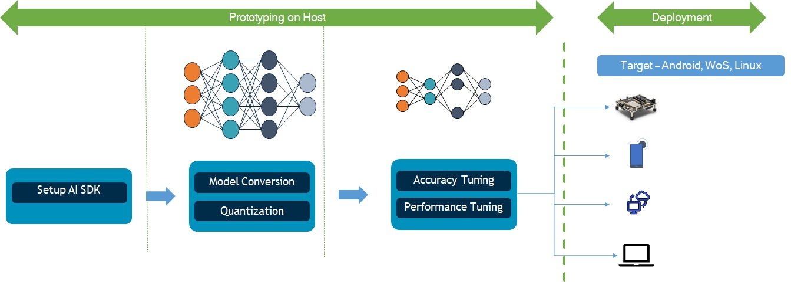

# Qualcomm AI Stack Models

## Introduction - AI Solutions

AI solutions directory contains end-to-end AI solutions across various Qualcomm platforms.

Workflow to for AI solutions across platforms is given below.

- Use "models-for-solutions" in this repository, and prepare models
- Use the prepared models to prepare end-to-end AI solutions
   
Summary of AI Solutions across platforms is given in below table

<table style="width:50%;text-align: center">
   <tr>
    <th>Use Case</th>
    <th>Python (SNPE)</th>
    <th>Android (SNPE)</th>
    <th>Python (QNN)</th>
    <th>Android (QNN)</th>
    <th>WoS</th>
    <th>RB5-LU</th>
    <th>RB5-LE</th>
    <th>QCS8550-LE</th>
  </tr>
  <tr>
    <td>Image Super Resolution</a></td>
    <td><a href="android-SNPE/01-ImageSuperResolution">Notebooks</a></td>
    <td><a href="android-SNPE/01-ImageSuperResolution">APK</a></td>
    <td><a href="android-QNN/01-ImageSuperResolution">Notebooks</a></td>
    <td><a href="android-QNN/01-ImageSuperResolution">APK</a></td>
    <td><a href="windows/electron-app-cv">WoS App</a></td>
    <td><a href="ubuntu/electron-gui">RB5 APP</a></td>
    <td><a href="QRB5165-embedded-linux">CLI</a></td>
    <td><a href="QCS8550-embedded-linux">CLI</a></td>
  </tr>
    <tr>
    <td>Low-Light Image Enhancement</a></td>
    <td><a href="android-SNPE/02-ImageEnhancement">Notebooks</a></td>
    <td><a href="android-SNPE/02-ImageEnhancement">APK</a></td>
    <td> Not Applicable </td>
    <td> Not Applicable </td>
    <td><a href="windows/electron-app-cv">WoS App</a></td>
    <td><a href="ubuntu/electron-gui">RB5 APP</a></td>
    <td><a href="QRB5165-embedded-linux">CLI</a></td>
    <td><a href="QCS8550-embedded-linux">CLI</a></td>
  </tr>
  <tr>
    <td>Object Detection</a></td>
    <td><a href="android-SNPE/03-ObjectDetection">Notebooks</a></td>
    <td><a href="android-SNPE/03-ObjectDetection">APK</a></td>
    <td> Not Applicable </td>
    <td> Not Applicable </td>
    <td><a href="windows/electron-app-cv">WoS App</a></td>
    <td><a href="ubuntu/gstreamer-cli">RB5 APP</a></td>
    <td><a href="QRB5165-embedded-linux">CLI</a></td>
    <td><a href="QCS8550-embedded-linux">CLI</a></td>
  </tr>
  <tr>
    <td>Image Segmentation</a></td>
    <td><a href="android-SNPE/04-ImageSegmentation">Notebooks</a></td>
    <td><a href="android-SNPE/04-ImageSegmentation">APK</a></td>
    <td> Not Applicable </td>
    <td> Not Applicable </td>
    <td><a href="windows/electron-app-cv">WoS App</a></td>
    <td><a href="ubuntu/gstreamer-cli">RB5 APP</a></td>
    <td><a href="QRB5165-embedded-linux">CLI</a></td>
    <td><a href="QCS8550-embedded-linux">CLI</a></td>
  </tr>
  <tr>
    <td>Question-Answering</a></td>
    <td><a href="android-SNPE/05-QuestionAnswering">Notebooks</a></td>
    <td><a href="android-SNPE/05-QuestionAnswering">APK</a></td>
    <td> Not Applicable </td>
    <td> Not Applicable </td>
    <td><a href="windows/angular-app-nlp">WoS App</a></td>
    <td> Not Applicable </td>
    <td> Not Applicable </td>
    <td> Not Applicable </td>
  </tr>
</table>
