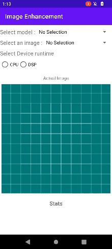

# Table of Contents

- [Table of Contents](#table-of-contents)
- [Introduction](#introduction)
    + [About "Image Enhancement"](#about--image-enhancement-)
    + [Pre-Requisites](#pre-requisites)
- [Model Selection and Conversion](#model-selection-and-conversion)
    + [Model Overview](#model-overview)
    + [Model Conversion](#model-conversion)
- [Source Overview](#source-overview)
    + [Source Organization](#source-organization)
    + [Code Implementation](#code-implementation)
- [Build APK file with Android Studio](#build-apk-file-with-android-studio)
- [Results](#results)

# Introduction

### About "Image Enhancement" 

- Current project is an sample Android application for AI-based Low-light Image Enhancement using [Qualcomm® AI Engine Direct](https://docs.qualcomm.com/bundle/publicresource/topics/80-63442-50/introduction.html) framework.
- We have used 4 Models in this Solution
- This sample enhances a low-light image to make it brighter.
- If users intend to use a different model in this demo framework, **image pre/post processing will be needed**. 
- Current pre/post processing is specific to the models used. 

### Pre-Requisites 

- Qualcomm® AI Engine Direct setup should be completed by following the guide [here](https://docs.qualcomm.com/bundle/publicresource/topics/80-63442-50/setup.html)
- Install onnx and onnxruntime using `pip install onnx onnxruntime`
- Android Studio to import sample project
- Android NDK to build native code
- Install opencv using ```pip install opencv-python```

# Model Selection

### Model Overview

Please refer to Models repository for model overview
<TODO> Add public link

### Model Conversion

Please refer to Models repository for model overview
<TODO> Add public link


# Source Overview

### Source Organization

- demo: Contains demo video, GIF 
- enhancement: Contains source files in standard Android app format.
- enhancement\src\main\assets, enhancement\src\main\jniLibs\arm64-v8a : Contains Model library file / cached binary
- enhancement\src\main\java\com\qcom\enhancement : Application java source code
- enhancement\src\main\cpp : Application C++(native) source code
- sdk : Contains openCV sdk (Will be generated using _ResolveDependencies.sh_ )
   
### Code Implementation

- Model Initialization

  `public boolean loadingMODELS(String runtime_var, String model_name)`
    - runtime_var: Name of the backend. Possible options are "libQnnCpu.so", "libQnnHtp.so".
    - model_name: File name of the stored model. Based on the backend, it is loaded dynamically.
  
- Running Model

    - Following is the Java Function, that handles model execution. This function iternally calls sub functions to handle pre-processing and post-processing

      `inferQNN(inputMat.getNativeObjAddr(), outputMat.getNativeObjAddr())`
        - inputMat is opencv Matrix that contains input image.
        - outputMat is the destination for the output image

    - C++ function that handles preprocessing for the input image.

      `preprocess(cv::Mat &img, std::vector<int> dims) `

    - C++ function that handles postprocessing after we receive input from model

      `postprocess(cv::Mat &outputimg)`

    - QNN API function that runs the network and give result

      `qnn->execute(inputMap, outputMap);`


# Build APK file with Android Studio  

1. Clone this repo.
2. Set the environment variable `QNN_SDK_ROOT` by running the command `export QNN_SDK_ROOT=<QNN_SDK_PATH_HERE>`, suitably replacing the placeholder. After that, execute `bash resolveDependencies.sh`.
    * This script will download opencv and paste to sdk directory, to enable OpenCv for android Java.
    * This script will copy all necessary library files to `enhancement\src\main\jniLibs\arm64-v8a` for execution.
3. Generate model files using the steps mentioned.
4. Import folder 02-ImageEnhancement as a project in Android Studio 
5. Do gradle sync
6. Compile the project. 
7. Output APK file should get generated : enhancement-debug.apk
8. Prepare the Qualcomm Innovators development kit(QIDK) to install the application (Do not run APK on emulator)
9. Install and test application : enhancement-debug.apk

```java
adb install -r -t enhancement-debug.apk
```

10. launch the application

Following is the basic "Image Enhancement" Android App 

1. Select one of the models
2. Select one of the given images from the drop-down list
3. Select the run-time to run the model (CPU or DSP)
4. Observe the result of model on screen
5. Also note the performance indicator for the particular run-time in mSec

Same results for the application are shown below 

# Results

- Demo video, and performance details as seen below:
	


###### *Qualcomm Neural Processing SDK and Snapdragon are products of Qualcomm Technologies, Inc. and/or its subsidiaries. AIMET Model Zoo is a product of Qualcomm Innovation Center, Inc.*