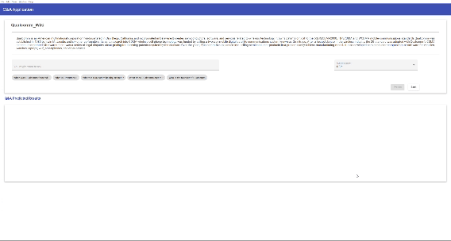
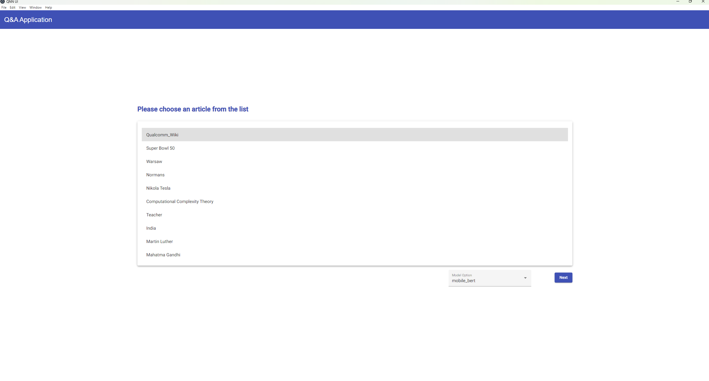
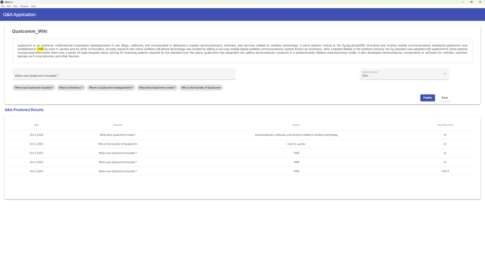
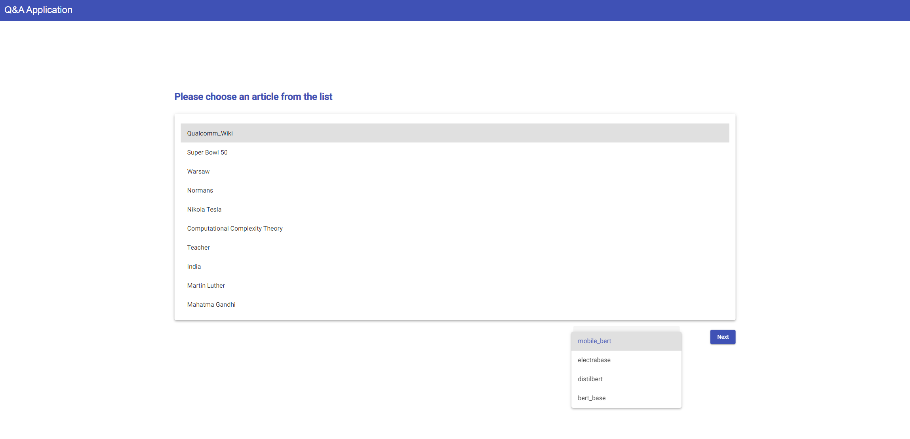
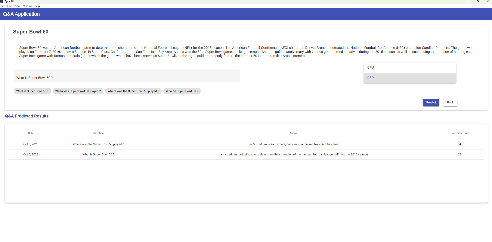

### For Internal Purpose
* dlc: Paste your dlc model in the pyton_flask_server directory  
* SNPE LIBS: paste at any appropriate location and mention the path in CMakelists.txt
* SNPE INCLUE: paste at any appropriate location and mention the path in CMakelists.txt
* ZeroMQ LIBS: paste it in C:\Program Files (x86) and mention the path in CMakelists.txt
* cppzmq: paste it in C:\Program Files (x86)
* SNPE_CPP_CODE: paste all files present in **\\upagrah\hyderabad_qidk\sahinhos\Language Models\Windows Asset** directory to SNPE_CPP_CODE folder of this github repo, After that you can simply run from SNPE_CPP_CODE/build/Debug/snpe-sample.exe.

### Dependencies:
* Python 3.8 is installed.
* Visual Studio 2022 is installed based on instructions given at https://docs.qualcomm.com/bundle/publicresource/topics/80-62010-1/Install-Visual-Studio-2022.html?product=Windows%20on%20Snapdragon
* This Windows Application has to run on SM8550 or Above Architecture.

## Directory Structure :
This Repo Contains 3 directories, which handle different aspects of this project.

1. **Electron app UI**: This directory contains UI code and handles the part to start UI and connecting it to flask server. Here, User provides input question and the corresponding paragraph,selects the AI model  and runtime for their use. All this information is sent to python using ajax request.

2. **Python Flask Server**: Electron UI acts as foreground, and Flask server works in background to handle request from elecron UI. It takes all information given by elecron UI and pre-process the received question and paragraph here, and then give the processed inputs to SNPE_CPP_CODE for running the selected model. SNPE_CPP_CODE returns the output of the model and then we process the data given by model into human understandable form and return that back to Electron UI for display.

3. **SNPE_CPP_CODE**: This works as a service for flask server. This runs the preprocessed inputs on network and return the output given by model back to Flask Server. 
4. **Generating_DLC**: This .ipynb file is to generate the DLC.

## Commands for Making Standalone

* In python_flask_server:
  - Python pkg dependencies : `pip install empatches flask opencv-python pillow flask_cors zmq pyinstaller transformer`
  - Create dlc Directory and put DLC(s) there, Please follow Generating_DLC.ipynb to generate dlc.
  - To start flask server, please run 
		`python server.py`
  - It will start server at port : 9081
  - To view webpage on browser, please use this URL : http://localhost:9081

* In SNPE_CPP_Code:
  - **Apply zmq_support.patch to the SNPE SampleCode_Windows present in SNPE sdk. After that please copy all the files in that folder to SNPE_CPP_CODE folder in this github repo.**
  - For ZeroMQ, clone following gits and use their instructions to build those libs for your system, or you can follow below instructions to build.
	 - For libzmq: 
	  	- `git clone https://github.com/zeromq/libzmq.git`
		- `cd libzmq`
		- `mkdir build`
		- `cd build`
		- `cmake ../. -G "Visual Studio 17 2022" -D WITH_PERF_TOOL=OFF -D ZMQ_BUILD_TESTS=OFF -D ENABLE_CPACK=OFF -D CMAKE_BUILD_TYPE=Release`
		- Open _ZeroMQ.sln_ in Visual Studio
		- In Solution Directory, right click on INSTALL and _build_ solution 
		- See that the _ZeroMQ_ is installed in C Drive.

	  - For Cppzmq:
	   	- `git clone https://github.com/zeromq/cppzmq.git`
	     	- `cd cppzmq`
	      	- `mkdir build`
	      	- `cd build`
	      	- `cmake ../. -G "Visual Studio 17 2022"
	      	- Open _cppZMQ.sln_ in Visual Studio
	      	- In Solution Directory, right click on INSTALL and _build_ solution 
	      	- Confirm that _cppzmq_ is installed in C Drive.

  - Change following paths in CmakeLists.txt of SNPE_CPP_Code according to your setup:
	  - set (SNPE_INCLUDE_DIR _"C:/Qualcomm/AIStack/SNPE/2.12.0.230626/include/SNPE"_)
	  - set (SNPE_LIB_PREFIX _"C:/Qualcomm/AIStack/SNPE/2.12.0.230626/lib"_)
	  - set (ZERO_MQ_PATH _"C:/Program Files (x86)/ZeroMQ"_)
	  - Change DLL filename, according to your setup: get_filename_component(ZMQ_DLL_PATH "${ZERO_MQ_PATH}/bin/_libzmq-v143-mt-gd-4_3_5.dll_" REALPATH BASE_DIR ${CMAKE_CURRENT_SOURCE_DIR})
  - Create a build folder and build files.
	  - `Mkdir build`
	  - `Cd build`
	  - `cmake ../ -G "Visual Studio 17 2022" -A ARM64`
	  - `cmake --build ./ --config Release`

  - For running, please go to build/Release folder and run snpe-sample.exe

 * Inside electron_app_ui:
   - Execute `npm install`. This will make node modules directory which will contain all necessary npm packages.
   - Then Execute `npm run build`
   - Then Execute  `npm run dist`
   - After this it'll create .exe file inside release folder, please install the app then it's ready to run.
   - If you want to check in browser just use `npm start` command, this will open the Application in the broswer.

https://github.qualcomm.com/storage/user/11796/files/2f187531-98ea-4671-b3c2-bf0b07ac216d

Note: Make sure that you have resolved all dependencies mentioned in "Making Standalone" Section, like setting SNPE and ZMQ libs, installing python packages etc.

