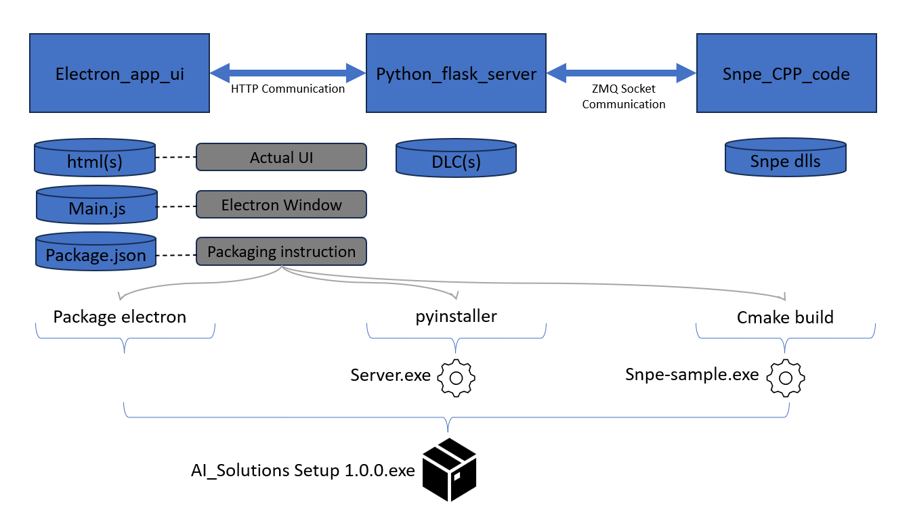

## Table of Contents

- [Table of Contents](#table-of-contents)
- [Environment Setup](#environment-setup)
- [Dependencies](#dependencies)
- [Directory Structure](#directory-structure)
- [Prepare Executable - Windows-on-Snapdragon](#prepare-executable---windows-on-snapdragon)
  * [Prepare stand-alone executable - Windows](#prepare-stand-alone-executable---windows)
  * [Prepare Installer](#prepare-installer)

## Environment Setup

Prepare required assets to build the application 

* DLC: Paste it in "C:\Qualcomm\AIStack\AI_Solutions" directory  
* SNPE LIBS: paste at any appropriate location and mention the path in CMakelists.txt
* SNPE INCLUDE: paste at any appropriate location and mention the path in CMakelists.txt
* ZeroMQ LIBS: paste it in C:\Program Files (x86) and mention the path in CMakelists.txt
* cppzmq: paste it in C:\Program Files (x86)
* SNPE_CPP_CODE: paste all files present in this directory to SNPE_CPP_CODE folder of this github repo.

## Dependencies
* Python 3.8 is installed.
* Visual Studio 2022 is installed based on instructions given at https://docs.qualcomm.com/bundle/publicresource/topics/80-62010-1/Install-Visual-Studio-2022.html?product=Windows%20on%20Snapdragon
* Download and install latest Visual C++ Redistributable.
* Models used in this solution need to be generated, using steps mentioned at https://github.com/quic/ai-stack-models/tree/main/models-for-solutions


## Directory Structure
This Repo Contains 3 directories, which handle different aspects of this project.

1. Electron app UI: This directory contains UI code and handles the part to start UI and connecting it to flask server. Here, User provides input image, selects the AI model for their use. All this information is sent to python using ajax request.

2. Python Flask Server : Electron UI acts as foreground, and Flask server works in background to handle request from elecron UI. It takes all information given by elecron UI and pre-process the received image here, and then give the processed image to SNPE_CPP_CODE for running the selected model. SNPE_CPP_CODE returns the output of the model and then we process the data given by model into human understandable form and return that back to Electron UI for display.

3. SNPE_CPP_CODE: This works as a service for flask server. This runs the preprocessed image on network and return the output given by model back to Flask Server. 



## Prepare Executable - Windows-on-Snapdragon

### Prepare stand-alone executable - Windows
* In python_flask_server:
  - Python pkg dependencies :
	  ```bash
	  pip install empatches flask opencv-python pillow flask_cors zmq pyinstaller waitress torch
	  ```
  - Create DLC Directory and put DLC(s) under there respective folders at "C:\Qualcomm\AIStack\AI_Solutions\DLC". For example, path of superresolution dlc will be "DLC/superesolution" and ImageEnhancement be "DLC/imageenhancement". Please follow relevant section for generating DLC.  <--TODO.
  - To start flask server, please run: 
	   ```bash
	   python server.py
	   ```
  - It will start server at port : 9081
  - To view webpage on browser, please use this URL : http://localhost:9081

* In SNPE_CPP_Code:
  - Apply zmq_support.patch to the SNPE SampleCode_Windows present in SNPE sdk. After that please copy all the files in that folder to SNPE_CPP_CODE folder in this github repo.
  - For ZeroMQ, clone following gits and use their instructions to build those libs for your system, or you can follow below instructions to build.
	 - For libzmq: 

		 ```bash
		 git clone https://github.com/zeromq/libzmq.git
		 git reset --hard 9d31965548b5c734f1edc01742c39f984e9cedd8
		 cd libzmq
		 mkdir build
		 cd build
		 cmake ../. -G "Visual Studio 17 2022" -D WITH_PERF_TOOL=OFF -D ZMQ_BUILD_TESTS=OFF -D ENABLE_CPACK=OFF -D CMAKE_BUILD_TYPE=Release
		 ```

	- Open _ZeroMQ.sln_ in Visual Studio
	- In Solution Directory, right click on INSTALL and _build_ solution 
	- See that the _ZeroMQ_ is installed in C Drive.

        - For Cppzmq:

		```bash
		git clone https://github.com/zeromq/cppzmq.git
		git reset --hard 160ac8ec61298508093933a9f53bfedfb6ba0425
		cd cppzmq
		mkdir build
		cd build
		cmake ../. -G "Visual Studio 17 2022"
		```
	
	- Open _cppZMQ.sln_ in Visual Studio
	- In Solution Directory, right click on INSTALL and _build_ solution 
	- Confirm that _cppzmq_ is installed in C Drive.


  - Change following paths in CmakeLists.txt of SNPE_CPP_Code according to your setup:
	```bash
	set (SNPE_INCLUDE_DIR "C:/Qualcomm/AIStack/SNPE/2.12.0.230626/include/SNPE")
	set (SNPE_LIB_PREFIX "C:/Qualcomm/AIStack/SNPE/2.12.0.230626/lib")
	set (ZERO_MQ_PATH "C:/Program Files (x86)/ZeroMQ")
	```
  - Change DLL filename, according to your setup: get_filename_component(ZMQ_DLL_PATH "${ZERO_MQ_PATH}/bin/_libzmq-v143-mt-gd-4_3_6.dll_" REALPATH BASE_DIR ${CMAKE_CURRENT_SOURCE_DIR})
  - Create a build folder and build files.
	```bash
	mkdir build
	cd build
	cmake ../ -G "Visual Studio 17 2022" -A ARM64 -DCHIPSET=SC8380
	cmake --build ./ --config Release
	```

  - For running, please go to build/Release folder and run snpe-sample.exe

 * In electron_app_ui:
   - Execute 
   ```bash
   npm install
   ```
   This will make node modules directory which will contain all necessary npm packages.
   - To start UI, please run : 
   ```bash
   npm start
   ```

### Prepare Installer

Please execute following commands. These will generate "dist" directory which will contain all your packaged data.
```bash
npm install
npm run package
```

Note: Make sure that you have resolved all dependencies mentioned in [Prepare stand-alone executable](#prepare-stand-alone-executable) section, like setting SNPE and ZMQ libs, installing python packages etc.

### Supported Platforms

This solution is verified on following compute platforms

- Snapdragon X Elite
- Althorugh not verified, this application, and procedure is applicable to : SC8280XP as well. 

## Demo

https://github.com/quic/ai-stack-models/assets/121066912/b5ebc51b-083b-4abc-86a7-b1f3a6554d24
